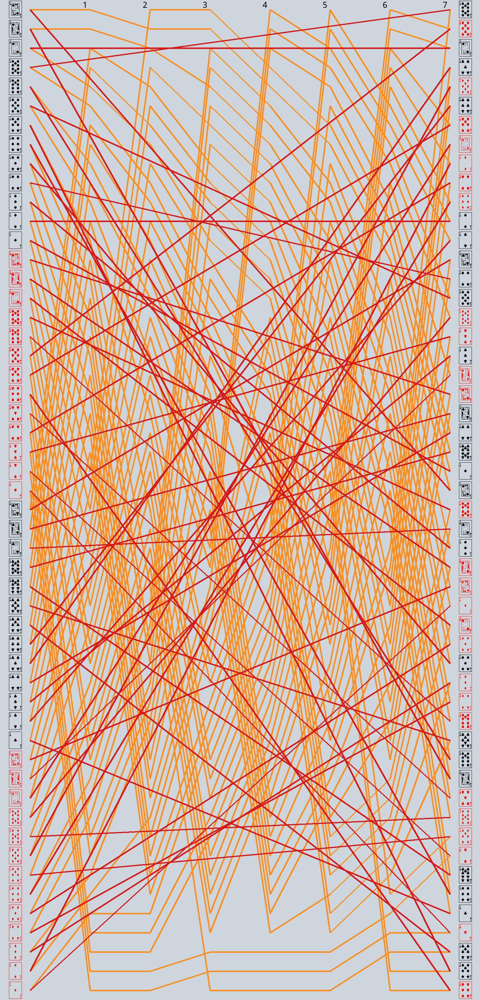

# Tracking the Position of Each Playing Card Through 7 Riffle Shuffles

I shuffled a deck of cards 7 times, checking the position of each card between shuffles.

Data is CC0 Licensed.

Code to generate the image is MIT Licensed.

You need to set the fonts in `shuffle_plot.py` and a card font for example - [Such as Ryan Neaveill's](https://freefontsdownload.net/free-playing_cards-font-16939.htm).